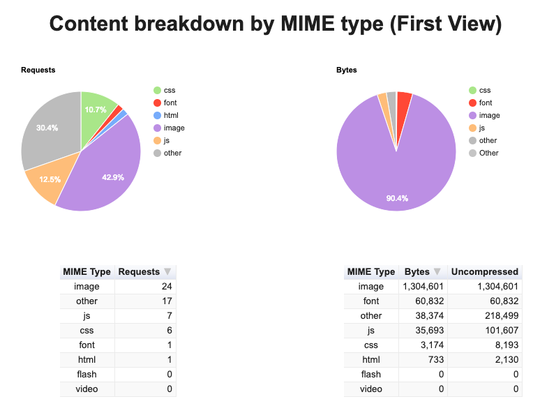

# Marvel Characters React
LIVE DEMO: [Marvel Characters React](https://monicargomes.github.io/marvel-characters-react/)
## Summary
1. [Introduction](#introduction)  
    * [Objective](#objective)
    * [Requirements](#requirements)
2. [Architecture](#architecture) 
    * [Overview](#architecture-overview) 
3. [Showcase](#showcase)
4. [Performance Evaluation](#evaluation)
5. [Further Considerations](#considerations)
6. [References and credits](#references) 
7. [Similar works](#similar-works) 

<a name="introduction" />

## Introduction
Web app created with [React.js](https://reactjs.org/) that uses [Marvel Comics API](https://developer.marvel.com/) in order to display a list of characters as a carousel and to present information about a chosen character in a beautiful and responsive UI.

<a name="objective" />

### Objective
The main purpose of this repository is to exercise Software Engineering abilities through the refactoring of a previous proof of concept, [Marvel Characters](https://github.com/monicargomes/marvel-characters), to use React.js. By the end of this work, one should be able to:
* Query a backend API that requires authentication using Fetch API;
* Remove heavy libraries such as JQuery and Material Icons;
* Exercise the use of React.js to build a single page application;
* Exercise the use of Jest and Enzyme for unit tests;
* Evaluate improvements on perfomance;

<a name="requirements" />

### Requirements
| ID | Description |
| --- | --- |
| REQ01 | Refactor all requests to Marvel Comics API to use Fetch API |
| REQ02 | Refactor all components to React.js components |
| REQ03 | Remove the import of heavy libraries and import only the icons needed |
| REQ04 | Change the url of the images that are requested in order to take images from the same size as the carousel container |
| REQ05 | Improve infinite scroll by requesting more characters from the API when the user scrolls until a defined length from the end |
| REQ06 | Improve how the list of comics of a chosen character are displayed by showing a loader while each image is not completely loaded |
| REQ07 | Improve search resposiveness by making the input take the whole screen width for mobile devices |
| REQ08 | Write unit tests for each component  |

<a name="architecture" />

## Architecture

<a name="architecture-overview" />

### Overview
This project was built with [React.js](https://reactjs.org/), a single page framework. [Create React App](https://github.com/facebook/create-react-app) was used to provide a build setup with no configuration. The backend is provided by Marvel through [Marvel Comics API](https://developer.marvel.com/), the requests were made through the Fetch API. [Iconmoon App](https://icomoon.io/) was also used in order to generate a font file for the icons needed. [Jest](https://jestjs.io/en/) and [Enzyme](https://airbnb.io/enzyme/) were used for unit testing the components.

<a name="showcase" />

## Showcase

  
  
  
  

<a name="evaluation" />

## Performance Evaluation
In order to evaluate the impact of this refactoring, the project was deployed to [Github Pages](https://pages.github.com/) and [WebPageTest](https://www.webpagetest.org/) was used to generate a performance evaluation which was later compared with the same evaluation for the previous version of this project. The graphs generated can be found bellow and the main performance results were:
* The load time decreased from 0.806s to 0.475s, an improvement of 41.07%;
* The time for the page to start rendering went from 0.7s to 0.2s, a reduction of 71.42%;
* The number of requests for the page fully loaded decreased from 57 to 30 requests, a reduction of 47.37%;
* The size of the page fully loaded reduced from 1415KB to 488KB, a reduction of 65.51%;

  
  
  
  

<a name="considerations" />

## Further considerations
This project presented interesting challenges such as finding the best way to update the Feature Character component based on the user interaction with other components, such as the Carousel or the Search components. The chosen approach was to have a state and a method to update this state in the App component, a high order component resposible for rendering all the components. Such method is then passed to the child components previously mentioned as props and is called when an event of click in a character is triggered. Other approachs such as using Redux or Publish Subscriber patterns were discarded as there was only one state to be handled for this project.      

Furthermore, the use of a single page application framework allowed a cleaner code, avoided DOM manipulation and improved performance. The components became more reusable and customazible, e.g. the Carousel which can receive properties such as "size", "title" and "nameStartsWith". 

Finally, the user experience became better since React.js uses the virtual DOM to update the elements on the page. Also, heavy resources such as JQuery and Material Icons were removed and replaced for pure CSS, Javascript and fonts generated with only the icons needed. The most heavy resource, the images, that were previously blocking other components from rendering are now rendered by their own component, allowing other contents to load faster.  

<a name="references" />

## References and credits
* [Marvel Comics API](https://developer.marvel.com/)

<a name="similar-works" />

## Similar works
* [Marvel Characters](https://github.com/monicargomes/marvel-characters)
* [Android Marvel Characters App](https://github.com/edsilfer/marvel-characters)